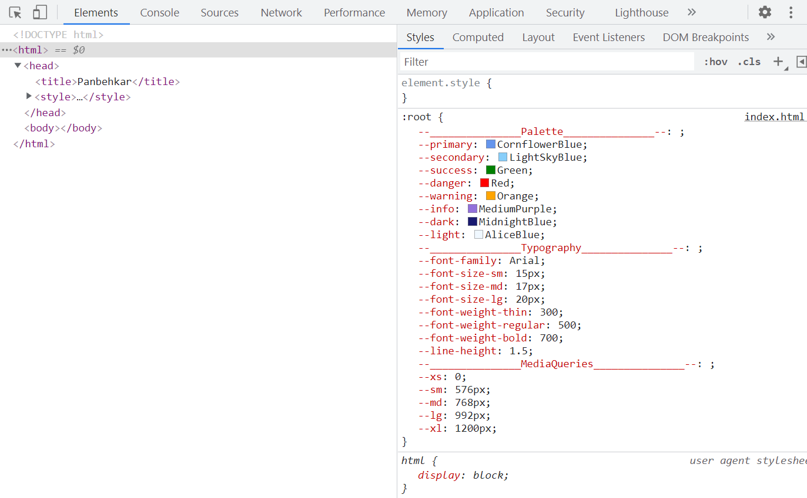

# Categorizing CSS variables 
I would like to share with you a pretty funny trick that allows you to represent the CSS variables section in a more readable style. Just take into account that this is not a new feature or best practice in CSS variables. It's only an interesting idea which I come up with.

Using variables in the browser's inspector can be confusing as the number of CSS variables gets increased. So to make it easier to read, here is my little trick, by using a variable name:

```css
:root {
  --_______________Palette_______________--: ;
  --primary: CornflowerBlue;
  --secondary: LightSkyBlue;
  --success: Green;
  --danger: Red;
  --warning: Orange;
  --info: MediumPurple;
  --dark: MidnightBlue;
  --light: AliceBlue;
  --_______________Typography_______________--: ;
  --font-family: Arial;
  --font-size-sm: 15px;
  --font-size-md: 17px;
  --font-size-lg: 20px;
  --font-weight-thin: 300;
  --font-weight-regular: 500;
  --font-weight-bold: 700;
  --line-height: 1.5;
  --_______________MediaQueries_______________--: ;
  --xs: 0;
  --sm: 576px;
  --md: 768px;
  --lg: 992px;
  --xl: 1200px;
}
```

Now let's see the result:
<div style="text-align: center;">
  
</div>

I hope you found it helpful 🌺
